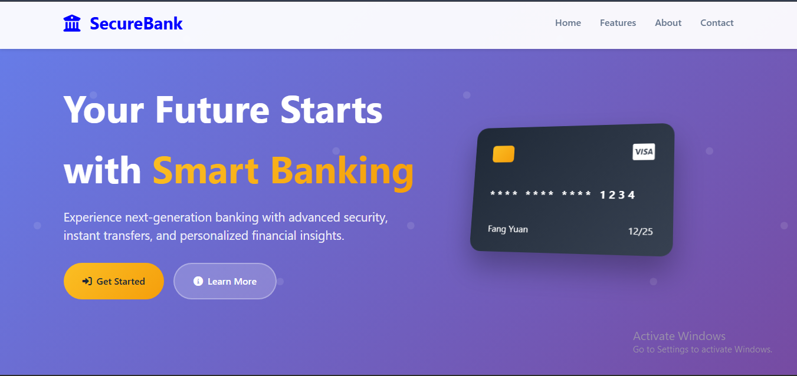
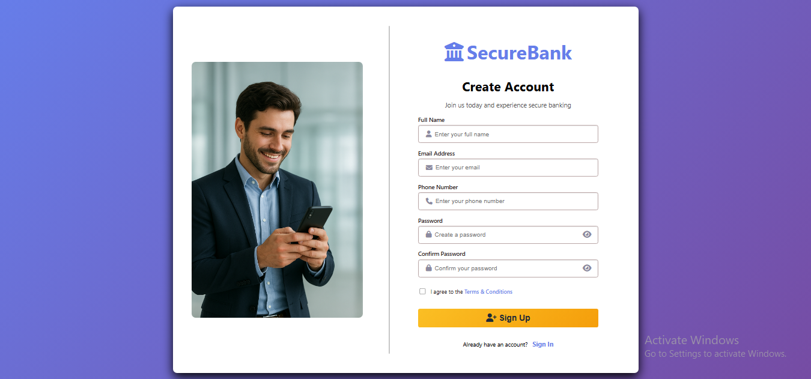
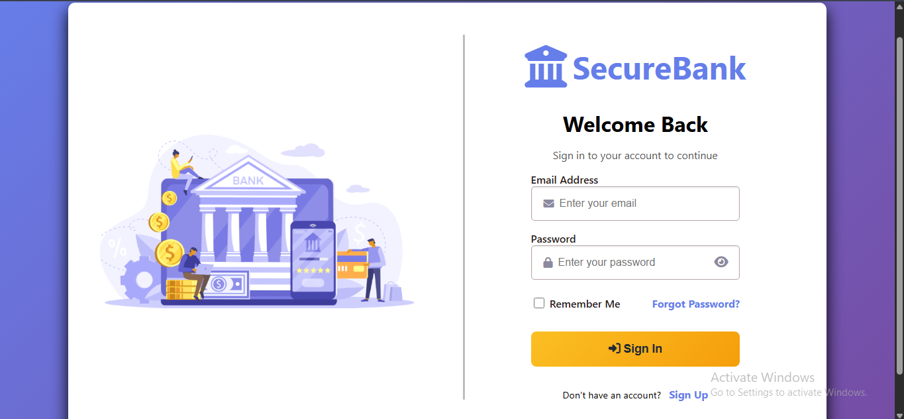
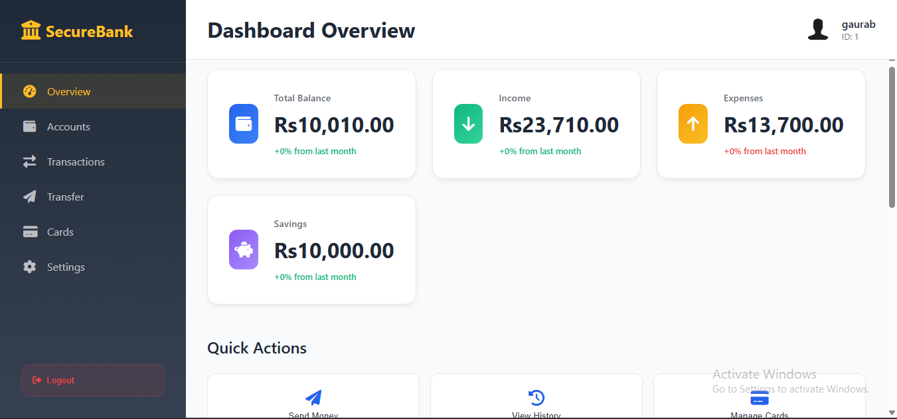
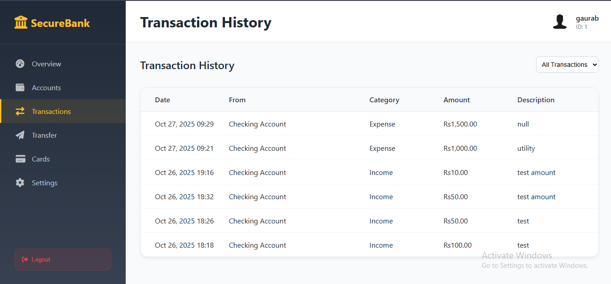

### 🏦 DBMS Project: Bank Management System

<div align="center">
  
  <br>
  <em> Main Application Interface</em>
</div>

# 📘 Overview

- The Bank Management System is a web-based database project designed to automate and manage core banking operations such as customer registration, account management, transactions, and record history.
- It simplifies data handling and improves security and efficiency in banking-related tasks.
- This project is developed using PHP, MySQL, HTML, CSS, and XAMPP.

---

# 🎯 Objectives

- To design a relational database system for managing bank records.
- To automate manual processes like deposits, withdrawals, and customer management.
- To ensure secure user authentication and easy data retrieval.
- To provide a simple yet functional web interface for both customers and admin.

---

## ⚙️ Features

# 🧾 User Features

**Signup Page:**

- Allows new customers to create an account.
- Stores customer details such as name, email, phone, and account type (Savings/Current).
- Validates duplicate entries and password strength.

<div align="center">
  
  <br>
  <em> Signup Interface</em>
</div>

**Login Page:**

- Authenticates users with email and password.
- Prevents unauthorized access using session management.

<div align="center">
  
  <br>
  <em> Login Interface</em>
</div>

**Dashboard:**

- Displays user profile, account balance, and recent transactions.
- Provides navigation to deposit, withdraw, and transaction history pages.

<div align="center">
  
  <br>
  <em> Dashboard Interface</em>
</div>

**Account Management:**

- Customers can view account details such as account type (Savings or Current), balance, and status.

**Transaction Management:**

- Deposit or withdraw money from accounts.
- Validates sufficient balance for withdrawal.
- Automatically updates balance in the database.

**Transaction History:**

- Displays complete record of deposits and withdrawals.
- Includes date, time, transaction type, and amount.

<div align="center">
  
  <br>
  <em> Transaction Interface</em>
</div>

---
## 👨‍💼 Admin Features

**Admin Login:**

- Only authorized admins can log in.

**Customer Management:**

- View, edit, or delete customer records.

**Transaction Monitoring:**

- View all user transactions in a single dashboard.

**Account Control:**

- Create, disable, or update customer accounts.

---

# 🧩 Database Design

Database Name: bank_db

**Main Tables:**

- Table Name	Description
- users	Stores user login credentials and profile info
- accounts	Contains account number, type (Savings/Current), balance
- transactions	Logs all deposit and withdrawal records
- admin	Stores admin login credentials

> 

---

# 🛠️ Tools & Technologies

```
Frontend: HTML, CSS, JavaScript

Backend: PHP

Database: MySQL

Server Environment: XAMPP

Editor: VS Code 
```

--- 

# ⚡ Setup Instructions

```
Install XAMPP
Copy the project folder into:
C:\xampp\htdocs\
Start Apache and MySQL in XAMPP Control Panel.
Open phpMyAdmin, create a database named: test
```

Import the bank_db.sql file (provided in the project folder).

```
Open your browser and run:
http://localhost/banking_system/index.html
```

**Default Admin Credentials:**

Username: void@gmail.com
Password: 123

---


# 📈 Future Enhancements

Add role-based access (Customer, Employee, Admin).
Integrate OTP/email verification during signup.
Enable online fund transfers between users.
Add PDF report generation for transactions.
Implement password encryption for enhanced security.

---

# 🙏 Acknowledgment

- This project was developed as part of the Database Management System (DBMS) course.
- Special thanks to [Instructor Name] and the Computer Engineering Department for guidance and support.

--- 

# 📜 License

This project is intended for educational purposes only.
Feel free to modify and reuse with proper credit.